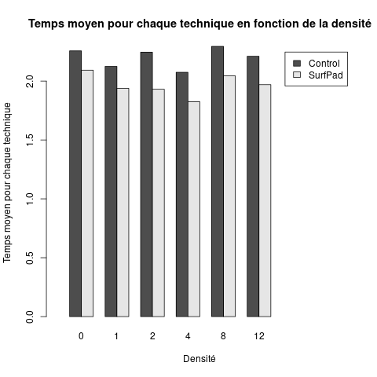

# NIHM -- TP Introduction à R
#### Arnaud Cojez

____________

## Exercice 3
[Fichier ex3.R](ex3.R)

## Exercice 4
[Fichier ex4.R](ex4.R)

## Exercice 5
[Fichier ex5.R](ex5.R)

#### Q8.


## Exercice 6
[Fichier ex6.R](ex6.R)

#### Q9.

Avec ezANOVA nous obtenons le tableau suivant :

```
$ANOVA
               Effect DFn DFd           F            p p<.05         ges
2           Technique   2  22  81.0212328 7.121165e-11     * 0.633639483
3                   W   1  11 159.3132475 6.908712e-08     * 0.497577951
4             density   5  55 128.1795788 5.041695e-29     * 0.452510669
5         Technique:W   2  22   3.9128982 3.516713e-02     * 0.023101336
6   Technique:density  10 110 146.0100034 1.083647e-58     * 0.593557688
7           W:density   5  55   3.4657930 8.562981e-03     * 0.017143292
8 Technique:W:density  10 110   0.7167081 7.071837e-01       0.008555489
```

Les trois premières lignes sont les effets principaux des facteurs Technique, W et density.
Les 4 dernières lignes représentent les interactions entre les effets principaux.

La colonne p représente la probabilité pour que les résultats soient dus au hasard. Lorsque p < 0.05, on considère que les tests sont significatifs et qu'ils n'ont pas été obtenus par hasard.
La colonne ges donne la puissance statistique d'un effet, c'est à dire la probabilité pour que l'expérience détecte cet effet.
Une puissance supérieure à 0.80 est considéré comme acceptable, dans ce cas, on considère que l'effet existe réellement.

On voit donc ici que les résultats ne sont pas dus au hasard (pour Technique, p < 0.5), mais on ne peut pas encore considérer que l'effet existe vraiment (ges < 0.80). On ne peut donc pas conclure que la technique Surfpad soit plus efficace qu'une autre.

#### q10.




Lorsque l'on affiche le graphe "Temps moyen des techniques en fonction de la densité" avec semPoint on constate que plus la densité augmente, plus le temps moyen augmente.
Au contraire, lorsque l'on affiche le même graphe sans SemPoint, on voit que le temps moyen n'augmente plus de façon significative et que l'écart entre chaque technique est quasiment le même. Dans ce cas, on considère donc que la densité n'a pas d'impact sur l'efficacité de la technique.

On peut donc conclure qu'en supprimant les données de la technique SemPoint, l'interaction entre Technique et Density n'existerait plus.
